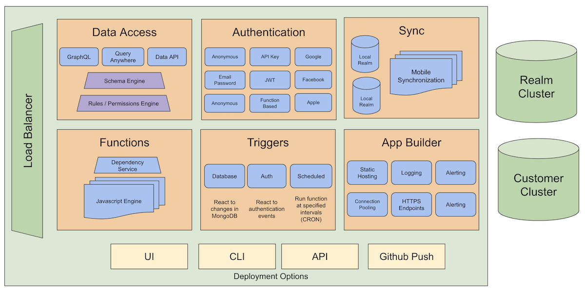
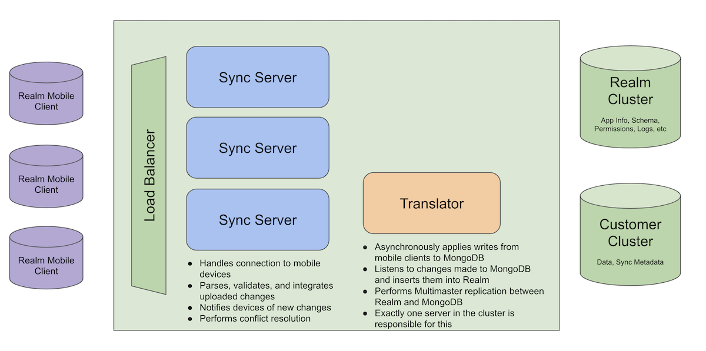
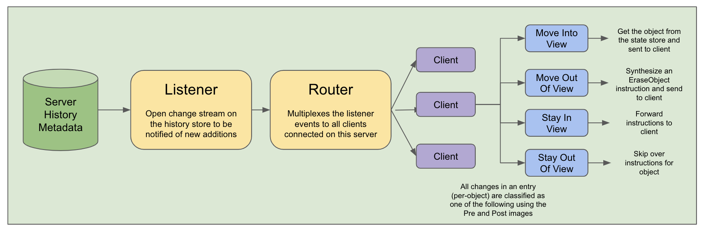

# MongoDB Realm Flexible Sync

## A primer by an engineer, for an engineer

Hi! My name is Tyler and I am an engineer on the Realm Sync team.

I am incredibly happy and excited to finally put Flexible Sync into users' hands. Although Partition Sync is powerful for a subset of use cases, we always knew that we wanted to ultimately remove the partitioning limitation and give users a less restrictive syncing experience.

I am incredibly proud of the work that our team did over the past few years to make it to this point and want to share some tips/tricks for getting started with flexible sync.

```
1. Overview
2. Schemas
3. Queryable Fields
4. Subscriptions
5. Permissions
```

## 1. Overview

### What is Realm Cloud?

Realm Cloud is an app building platform to make building applications with MongoDB faster, easier, and more scalable. It contains features such as: 
1. Authentication and session management 
2. Triggers: run functions in response to modifications made in MongoDB 
3. GraphQL Service 
4. Mobile Sync 

And many others, but those are just a few to highlight. To see the whole suite of services offered by Realm Cloud see the diagram below: 



### What is Sync? 

Sync was designed from the ground-up to provide a best-in-class experience for synchronizing data between mobile devices.

Taking a quick step back, lets first define the goals of MongoDB Realm Sync:

1. Immediate propagation of changes to connected devices:
   - Any time a change is made either from a mobile device or from an external MongoDB client (shell, driver, etc), the change is immediately sent to all relevant mobile devices if they currently have a connection to Realm Cloud.

2. Offline-first data:
   - The sync protocol allows devices to behave normally during network interruptions and automatically resume uploading / downloading changes from Realm Cloud when it regains internet connection in such a way that no changes are dropped or missed. This lets applications be designed to read and write data locally in Realm on the device and the data in Realm will be updated asynchronously when needed / possible. 

3. Conflict-Resolution:
   - If multiple devices are updating the same underlying MongoDB document, Realm Sync performs conflict resolution using the Operational Transformation algorithm.
   - For simple updates such as Update("field1", 123) we use a "last writer wins" policy; however, when using lists, smarter resolutions are used to preserve the intent of the users change and incorporate both writes (think of two devices inserting an element into the same list)
   - For more information about the conflict resolution performed by realm [see here](https://docs.mongodb.com/realm/sync/learn/conflict-resolution/)


Sync is architected to maximize the throughput of the system and allows customers to pay only for the amount of sync traffic that they generate. 




## 2. Schemas

While it is true that MongoDB is "schemaless" and can store unstructured data, most application developers want their applications to contain a schema in order to ensure data integrity and not require complex data validation on the device side.

Therefore, in order to use Realm Sync a schema needs to be defined for the application.

Realm supports the following types:
- Primitives: string, int, double, float, bool, uuid, objectId, date, binData, decimal128
- Mixed: can be any of the above types or a linking object
- Embedded objects: these are how MongoDB users often model their relationships for a 1:1 or 1:N when the sub-object is "owned" by the parent object
- Linking objects: both objects map to a document in MongoDB with its own _id field and the link is functionally a "lookup" or "join"
- List: an ordered list that can contain any primitive type, mixed, linking object, or embedded objects
- Set: an un-ordered list that can contain any primitive type, mixed, or linking object (not embedded objects)
- Dictionary: a key-value object for unstructured data where the value can be any primitive type, mixed, linking object, or embedded object.

[See here](https://docs.mongodb.com/realm/sync/data-model/sync-schema-overview/) for more information on Realm schemas. 

### 2.1: Defining a schema

This can be done one of 2 ways:
1. Server-Side Schema Definitions:
    - If you define your schema server-side in the Realm Cloud UI or using the realm-cli to import an application, then you can define all of your schemas in the "Schemas" tab of the Realm websitr by using JSON schema. 
    - A handy feature is that if your MongoDB collection already contains data, you can click "generate schema" and documents will be sampled from the collection and a schema will be generated automatically and you can make tweaks from there. 
    - If you choose this route, you may also find it helpful to navigate to the SDK's tab and click on "Data Models" and you can copy/paste the schema you have defined in the languages of each of the various SDKs (swift, obj-c, java, kotlin, js, c#).

2. Client-Side Schema Definitions (Developer Mode):
    - If you are used to working with Realm and dont want to play with a JSON schema, then you can enable "developer mode" in the sync configuration page
    - This will allow the device to upload the schema defined in the SDK to the server and automatically populate the server-side JSON schema. 
    - This is very handy if you are prototyping and need to keep adding fields.
    - However, it is not recommended that an application be put into production with developer mode still enabled.

### 2.2: Making changes to your schema

Making changes to your schema is supported by sync however there are some caveats. Therefore schema changes are categorized into two main types:

1. Non-Breaking Changes: 

	Adding a new table or a new field to an existing table is considered a non-breaking change. When this happens, sync will initiate a "re-sync" on the modified collections by re-downloading objects in the collection and replacing them in Realm Sync so that they will contain the values for any new fields should they exist. 


2. Breaking Changes: 

    Some types of schema modifications are "breaking" changes and sync cannot progress without restarting sync (removing all metadata). 
    
    This includes: changing the type of a field, changing the name of a field, removing a field, and changing the required-ness of a field. 
    
	The simple TLDR about why these cannot be fully supported is that sync is history-based, and all of the changes below will result in invalid history that could break other (older) devices (references to fields that dont exist, strings for a field that is now an integer, etc). 

    These changes can only be made from the UI (not from a device in dev mode or the realm-cli) in order to eliminate the possibility of accidentally doing this. When you make a breaking change, the UI will warn you of the implications but functionally what will happen is: 
    1. Sync will terminate and remove all sync metadata 
    2. Sync will re-initialize and download all data from MongoDB and add it to Realm Sync
    3. All devices will receive a Client Reset error sent to them to perform a ClientReset (TODO: See here) and then reconnect and resume syncing

    While this works without any issues, it is still advised that breaking changes be minimized, especially in production applications. 

    Some helpful tips and tricks to avoid them: 
    1. Instead of renaming a field name or type, try just creating a second field
    2. Instead of removing a field from the server-side schema, leave it in there and just remove it from your SDK definitions and it will be "invisible". 

// TODO: Link to new doc 


## 3: Queryable Fields 

One requirement of sync is to define a set of "queryable" fields. These are the fields that can be referenced by 
either the SDK's subscription or the read and write permissions defined for Flexible Sync. (both of these will be covered below). 

### 3.1: Why  do we need them? 

The reasoning why these are needed is very technical, but essentially a lot of metadata is needed for Flexible Sync to work efficiently. Flexible sync sessions have 4 main states: 

1. Offline: the device is disconnected from the server. 
2. Bootstrapping: the device is opening a new session or changing its subscription 
	- The server will query the "state" metadata to send the most compact result set possible 
3. Catching Up: the device is resuming sync after being previously disconnected
	- The server will query on the "history" metadata to catch the device up on all new changes 
4. Steady-State: the device is caught up to the most recent changes being made and connected to the server
	- The server will forward along any changes relevant to the device (in its subscription AND permissions)

For these last two states, it is important that Sync have an easy way to determinbe if a set of changes is relevant to a particular device. Thus, the pre/post images of the queryable fields are annotated with each entry in history to enable us to be able to quickly determine if a device cares about a particular history entry. 

For each history entry, the server categorizes it into 1 of 4 possible actions: 
1. The change was on an object that was in the view of the subscription set and still is in it: forward the change to the device
2. The change was on an object that was in the view of the subscription set and is now no longer in it: remove the object from the SDK
3. The change was on an object that was not in the view of the subscription set and now is in it: get the full state of the object and send it to the SDK 
4. The change was on an object that was not in the view of the subscription set and still is not in it: discard the change and continue processing 

See below for a summary of how the steady-state routing of changes works in Flexible Sync. 



Thus, there is in some ways a linear correlation between how much data is in a set of queryable fields (number of fields x size of the underlying data for that field), and the amount of metadata sync has to persist. 


### 3.2: Limitations on Queryable Fields

Queryable fields can currently be any primitive field in the Realm object. We are currently working on adding support for lists and embedded objects to be queryable as well and that should be done in the near future. 

###  3.3: Updating Queryable Fields

Updating the queryable fields defined for Flexible Sync is supported (even as sync is running). Adding a field is simple as it can be added and devices will not be interrupted at all and there is no effect on the system other than the fact that subcriptions can now refeence this field in all tables. 

Removing a queryable field is a bit trickier. This is supported by allowing the change to the set of queryable fields, disconnecting every device to make them all re-connect to sync (should be immediate), and then reject any devices that attempt to sync on the old field (makes sense sense as its not "queryable" any more). 

Therefore, if you are removing a queryable field in production, you should do the following: 
1. Remove the ability for your application to synthesize a subscription on that field from the SDK 
2. Release a patch to your application and ensure all devices have upgraded 
3. Remove the queryable field 

If the steps above are taken, then there should be no issues. 

## 4: Subscriptions

Flexible Sync allows you to define a query on the device and sync only the objects that match the query. When client-side makes a query, Realm searches the server-side data set for documents matching the query. 

Examples: 
- "'field1' == 123"
- "'field1' <= 123"
- "'field1' BEGINSWITH 'test'"


This is the core feature of Flexible Sync. A "subscription" can most easily be though of as the query that the SDK wants to sync the data for. 

Each SDK defines an API to manage the subscriptions that a device wants to sync on. Subscriptions can be added, removed, updated, or cleared. The SDK can update its subscriptions while sync is running and sync will continue working and any old data that the SDK should no longer have will be removed and any new data will be sent to the SDK. 

Flexible Sync does not support all the operators available in RQL. 
TODO: Flexible Sync RQL limitations for details.


## 5: Permissions


Flexible Sync has a more powerful permission system and can be applied on a per-document level in comparison to the partition-based permission system that does not offer granular filtering. 

You may be asking why permissions are needed when the SDK can just only subscribe to the data it is interested in. The simple answer is that as an App Developer / Admin on the project, you may want to restrict what data devices can query for and what data they are allowed to update.

Say your app has a text box and that input is used to create a subscription to sync on. As an admin, you may want to only allow them to read that data, or you want to only let them read a subset of that data. Permissions are how you can get these benefits. Additionally, you can have different permissions for different users, this is what "roles" are. 

### 5.1: Permissions Format: 

```json
{
	"rules": {
		"table1": [
			{
				"name": "read-all-write-all",
				"applyWhen": {},
				"read": true,
				"write": true,
			}
		]
	},
	"defaultRoles": [
		{
			"name": "default-admin",
			"applyWhen": { "%%user.isAdmin": true},
			"read": true,
			"write": true
		}, 
		{
			"name": "default-read-write",
			"applyWhen": { "%%user.id": "abc"},
			"read": true,
			"write": { "owner_id": "%%user.id" }
		}, 
		{
			"name": "default-read-only",
			"applyWhen": { },
			"read": true,
			"write": false
		}
	]
}
```

The fundamental bulding block of permissions is the "role". The role has the following fields: 
1. Name: useful for debugging and logging information about which role a device is assigned 
2. Apply When: used at connection time to determine if a rule should be assigned to a given user 
3. Write: evaluates for each document in an upload to determine if the user has the permissions to modify that document 
4. Read: evaluated for each document to determine if the device should be sent the document 
	- One caveat is that write permissions imply read permissions. IE: if the write permissions expression evaluates to true, then the device implicitly has read access to the document (even if the read expression evaluates to false)

For more details on Flexible Sync permissions [see here](https://docs.mongodb.com/realm/sync/data-access-patterns/permissions/#flexible-sync-session-roles-and-rules)

### 5.2: Default vs. Normal Roles

In all likelyhood, developers will want a single set of permissions to be applied to all tables/collections. For this, we have "defaultRoles". These are roles that will be applied to all tables. 

If, as a developer, you need a different set of permissions for different tables, then you can define table-specific permissions for a subset of tables. If table-specific roles are defined, then the default roles will not be evaluated for that table. This gives full flexibility to the developer to compose complex and expressive permissions for their application. 

If you are playing around with Flexible Sync and want to get something running quickly, you can just select "Users can read and write all data" as a permissions template on the Sync page and that should let you decide how you want to use permissions at a later time. 

### 5.3: Assigning a Role 

When a device connects, it is assigned a roll based on the set of permissions, user object, and custom user data using the following logic for each configured table name that a subscription exists for: 
1. If there are table-specific roles: 
	a. In the order they are defined in the list of roles, evaluate each role using the apply_when expression 
	b. If the apply_when evaluates to true, use that role for the user for the current table 
	c. Otherwise, go to the next role in the list and continue on 
2. If there are no table-specific roles, do the same steps as above but using the defaultRoles as the list of roles 

TODO: [See here]() for more details on how to use custom user data in Realm Sync. 


### 5.4: Changing Permissions

Changing the permissions in the sync configuration is supported while sync is running. All devices will be disconnected and then immediately reconnect in order to re-evaluate the roles. If the permissions for an existing device change (using a different role with different read/write permissions) then the device will experience a Client Reset and resume syncing normally. This is necessary because it implies that the device may have data that it is no longer allowed to have according to permissions. 

## 6. Conclusion 
With that, you should be ready to get syncing. If you run into any issues, feel free to reach out to one of the various support channels for MongoDB Realm. 

I am so happy that we can bring the power of flexible sync to customers and am even more excited about some of the many future projects we have planned, so stay tuned!! 

I hope that you enjoy sync and that it can make you, your organization, and your customers more productive! 
Tyler


